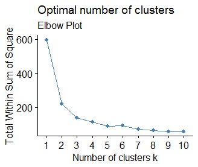

### Code
### this code uses the factoextra package to demonstrate how one can perform K means clustering using the iris dataset

#first load the library
library (factoextra)

#load the data
```
> head(iris)
  Sepal.Length Sepal.Width Petal.Length Petal.Width Species
1          5.1         3.5          1.4         0.2  setosa
2          4.9         3.0          1.4         0.2  setosa
3          4.7         3.2          1.3         0.2  setosa
4          4.6         3.1          1.5         0.2  setosa
5          5.0         3.6          1.4         0.2  setosa
6          5.4         3.9          1.7         0.4  setosa
> 
```
#We initially do not want the species column to be there in the table. Here we will cluster the data and see if the clusters identify with the species. To see how many different species you can do the following

Species <- iris$Species
table(Species)
```
> Species <- iris$Species
> table(Species)
Species
    setosa versicolor  virginica 
        50         50         50 
> 
```
#Remove the Species column and make a new table called data
```
> data <- iris[1:4]
> head(data)
  Sepal.Length Sepal.Width Petal.Length Petal.Width
1          5.1         3.5          1.4         0.2
2          4.9         3.0          1.4         0.2
3          4.7         3.2          1.3         0.2
4          4.6         3.1          1.5         0.2
5          5.0         3.6          1.4         0.2
6          5.4         3.9          1.7         0.4
> scaleddata <- scale(data)
> head(scaleddata)
     Sepal.Length Sepal.Width Petal.Length Petal.Width
[1,]   -0.8976739  1.01560199    -1.335752   -1.311052
[2,]   -1.1392005 -0.13153881    -1.335752   -1.311052
[3,]   -1.3807271  0.32731751    -1.392399   -1.311052
[4,]   -1.5014904  0.09788935    -1.279104   -1.311052
[5,]   -1.0184372  1.24503015    -1.335752   -1.311052
[6,]   -0.5353840  1.93331463    -1.165809   -1.048667
> 
```
#One can look at the distances using the dist function
distances <- dist(scaleddata)

#Determine the value of K by generating the Elbow plot with the following command
```
>fviz_nbclust(scaleddata, kmeans, method="wss")+labs(subtitle="Elbow Plot")
```

